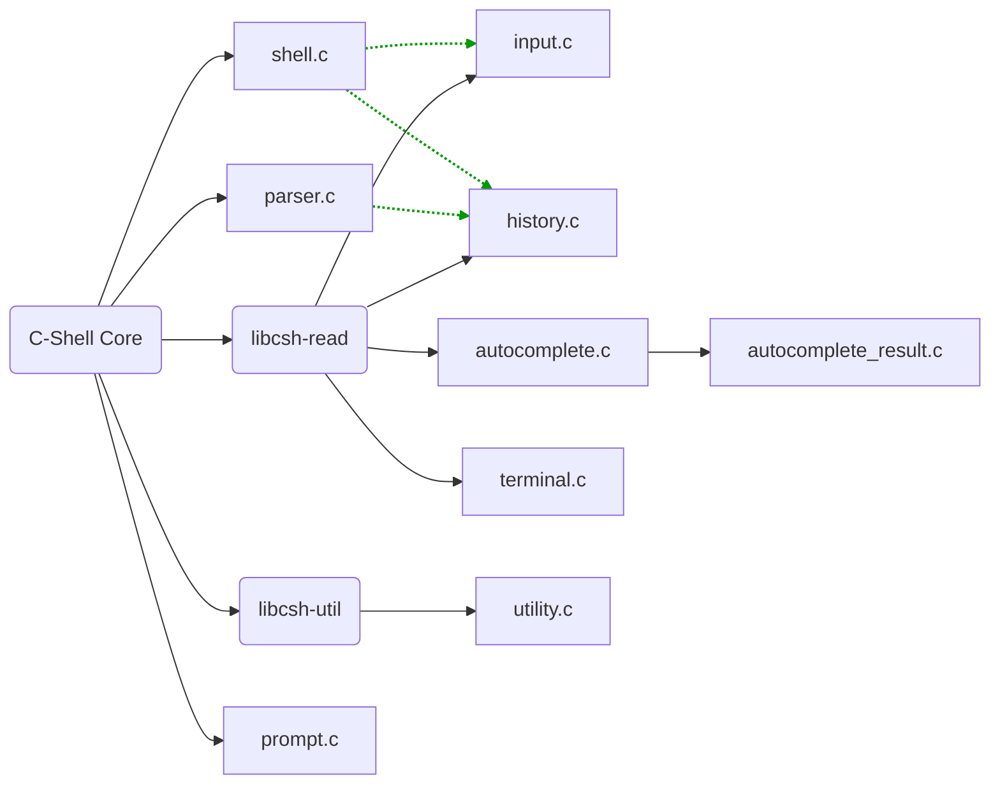

# C SHELL

Small shell project to learn more about C. Interested in learning about POSIX standards.

## Building from Source
### On NixOS
The project comes with a `flake.nix` that provides a dev-shell and a package-build for global installation.
For generally running the project simply run
```bash
nix develop --command make build-run
```
The `flake.nix` should package and build the `.a`-files from the c-shell-read repository into `CPATH`, making it accessible to the Makefile (`-lcshread`).

### On other Linux-Distros
Requirements:
Manually Clone and build the [c-shell-read](https://github.com/messatsuu/c-shell-read) library and add the resulting `.a`-file into `CPATH`.
Note Clang needs to be installed.
```bash
make build-run
```


## Current Architecture
Currently the project is split into two repositories to mimic the Bash/GNU-readline relationship

- [C-Shell](https://github.com/messatsuu/c-shell)
    - **Executing commands**
        - Piping to child processes
        - Handling outputting to File Descriptors
    - **input parsing**
        - Env-Vars
        - History-Commands
        - Built-in Commands
    - **Signal Handling**
- [C-Shell-Read](https://github.com/messatsuu/c-shell-read)
    - **Line Editing**
      - Keyboard shortcuts
      - Parsing and printing out $PS1
    - **Command History**
    - **Auto-Completion**
      - Tab-triggered suggestions
      - Context-sensitive completions
Incremental search (e.g., <kbd>Ctrl+R</kbd>)

### Current file structure and dependencies
This is the planned architecture, libcsh-util is currently still a single file (utility.h) and will be implemented into its own library when needed.
Calls made to the library are displayed in green.


## Planned features and bugfixes
### C-Shell
#### Parsing & AST-Structure
- [x] Escaping characters correctly (`echo \'`)
- [x] subshells (`(cd .. && pwd) && pwd`)
- [x] aliases (`alias ll='ls -la' ds='du -sh'`) (`unalias ll`)
- [x] simple file-parising (`source my-file`)
- [x] simple init-file parsing (~/.cshrc)
- [ ] argument expansion (`echo $(echo foo)`)
- [ ] Handling incomplete or multiline user-input over PS2 (`echo foo \`)
- [ ] Implement more bash-syntax
    - [ ] globbing (`ls /tmp/*swp`)
    - [ ] variable declaration
    - [ ] for-loops
    - [ ] while-loops

#### C-Shell-Read
- [x] Make autocomplete finish to nearest non-ambiguous term
- [x] Make autocomplete-engine parse more than paths
    - [ ] implement engines that are supplyable by the user (like readline)
