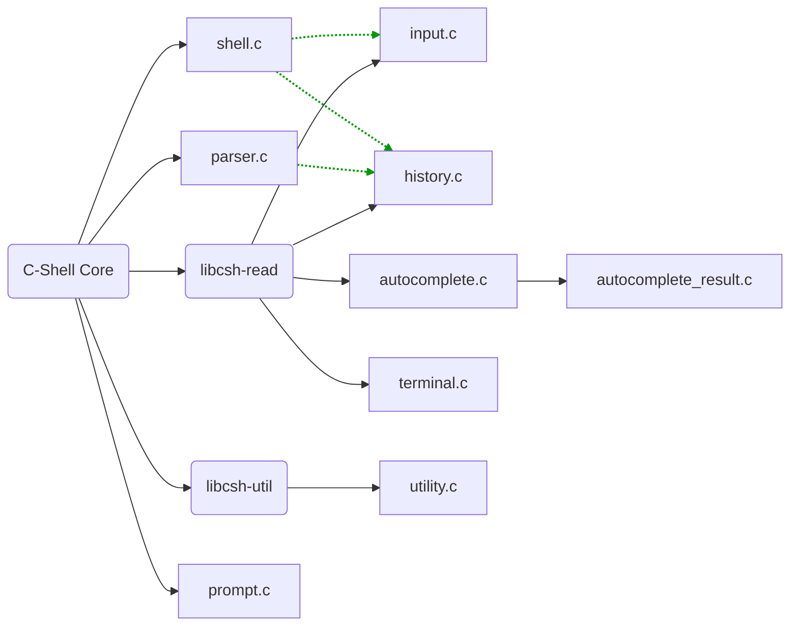

# C SHELL

Small shell project to learn more about C. Interested in learning about POSIX standards.
## Current Architecture
Currently the project is split into two repositories to mimic the Bash/GNU-readline relationship

- [C-Shell](https://github.com/messatsuu/c-shell)
    - **Executing commands**
        - Piping to child processes
        - Handling outputting to File Descriptors
    - **input parsing**
        - Env-Vars
        - History-Commands
        - Built-in Commands
    - **Signal Handling**
- [C-Shell-Read](https://github.com/messatsuu/c-shell-read)
    - **Line Editing**
      - Keyboard shortcuts
      - Parsing and printing out $PS1
    - **Command History**
    - **Auto-Completion**
      - Tab-triggered suggestions
      - Context-sensitive completions
Incremental search (e.g., <kbd>Ctrl+R</kbd>)

### Current file structure and dependencies
This is the planned architecture, libcsh-util is currently still a single file (utility.h) and will be implemented into its own library when needed.
Calls made to the library are displayed in green.

# Planned features and bugfixes
## C-Shell
### Parsing & AST-Structure
- [ ] Escaping characters correctly (`echo \'`)
- [ ] Handling incomplete or multiline user-input over PS2 (`echo foo \`)
- [ ] sub-shells (`echo $(echo foo)`)
- [ ] Implement more bash-syntax
    - [ ] variable declaration
    - [ ] for-loops
    - [ ] while-loops

## C-Shell-Read
- [ ] Make autocomplete finish to nearest non-ambiguous term
